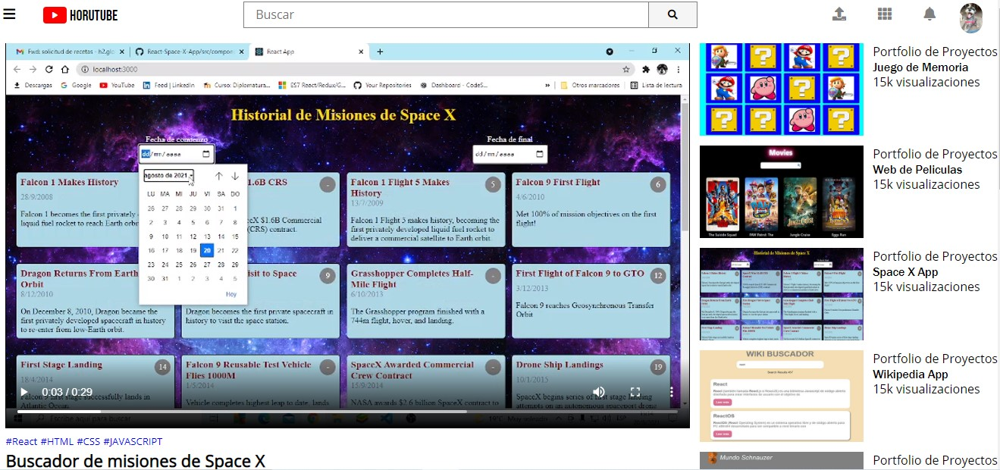

# Pagina-clon de -Youtube

<h3>Resumen de proyectos y certificados de estudio</h3>

Las fuentes para el logotipo son de GoogleFonts y los iconos de Font Awesome.

<h4>Tres secciones</h4>
<ul><li>Header</li>
  <li>Menu lateral</li>
  <li>Contenido Principal</li>
  </ul>
  
El contenido de la página se encuentra en un contenedor. A travez de <strong>Grid</strong> template columns se divide en dos columnas , el menu lateral con un tamaño fíjo y el contenido principal con el tamaño restante ,para cubrir cuando se cierre el menu.El header a travez de grid template areas abarca las dos columnas. A  travez de grid template rows se divide en dos filas ,una con el Header que  tiene un tamaño fíjo y la otra el menu y el contenido princípal abarcando el tamaño restante.

  
Con grid template columns el Header esta dividido en tres partes . Grid template areas le da un sector a cada uno, el primero con el boton de menu y el logo ,el segundo con la barra de busqueda y el tercero con los iconos y el avatar.
 

El contenedor cuenta con la clase active y un identificador ,con esto utilize <strong>document.Queryselector</strong> para acceder al boton del menu y un addeventlistener para el evento click que  ejecuta la funcion. La funcion ingresa a la lista de clases del contenedor y a travez del metodo <strong>toggle</strong> le da la clase active, (si no la tiene) y se la quita si la tiene.Así el menu cambia de tamaño deacuerdo al click del usuario.

El contenido principal lo hice con grid , un grid gap para que halla un espacio entre las imagenes de la grilla y un grid template columns para que tenga cuatro columnas.

La página que reproduce el video incluye la barra de navegación como las anteriores y para el contenido principal lo hice en una fila que contenga dos columnas, una para el video que se reproduce en la izquierda y la otra para la lista de videos en la derecha

 
Resumen a completar 🙏

<footer>Las páginas estan hechas con Html ,Css ,Bootstrap y Javascript</footer>
