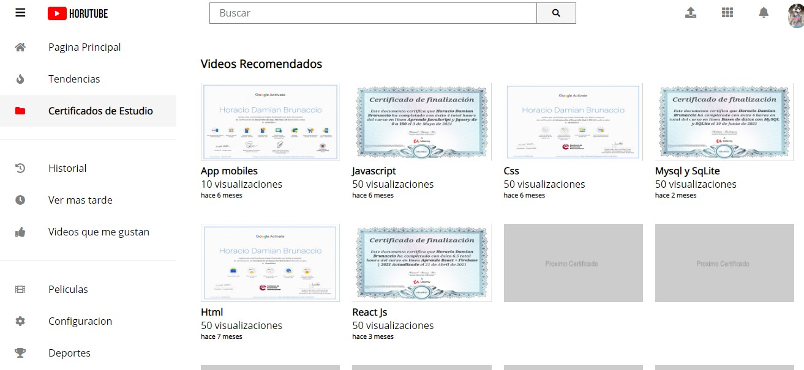

# Pagina-principal-Youtube

<h3>Resumen de proyectos y certificados de estudio</h3>

Las fuentes para el logotipo son de GoogleFonts y los iconos de Font Awesome.

<h4>Tres secciones</h4>
<ul><li>Header</li>
  <li>Menu lateral</li>
  <li>Contenido Principal</li>
  </ul>
  
El contenido de la pagina se encuentra en un contenedor. A travez de Grid template columns se divide en dos columnas , el menu lateral con un tamaño fijo y el contenido principal con el tamaño restante para cubrir cuando se cierre el menu.El header a travez de grid template areas abarca las dos columnas. A  travez de grid template rows se divide en dos filas ,una con el Header que  tiene un tamaño fijo y la otra el menu y el contenido principal abarcando el tamaño restante.

  
Con grid template columns el Header esta dividido en tres partes ,y grid template areas le da un sector a cada uno el primero con el boton de menu y el logo ,el segundo con la barra de busqueda y el tercero con los iconos y el avatar.

 
 
